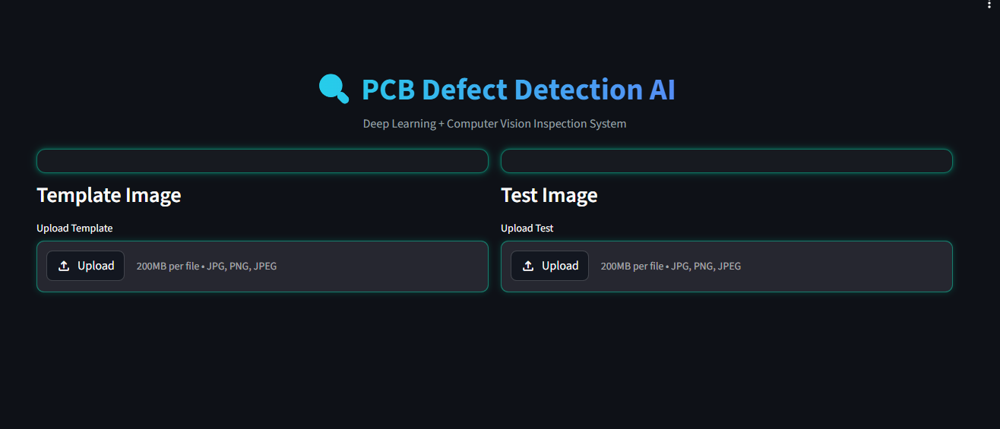
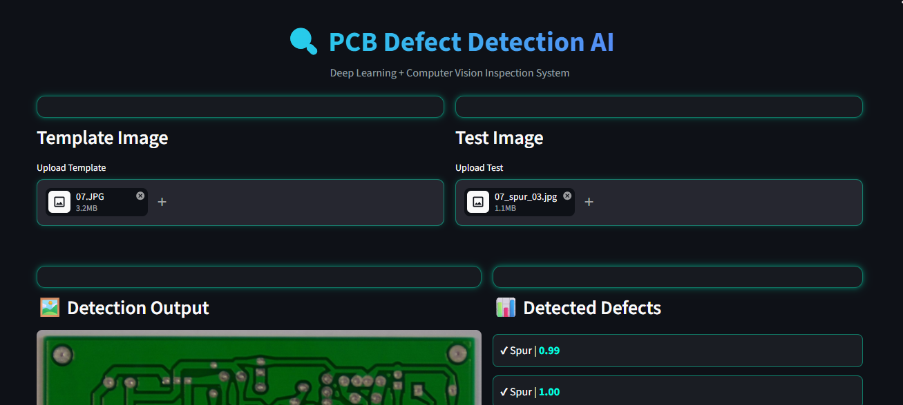
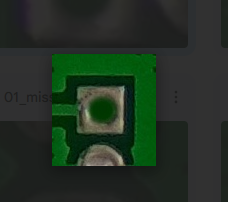

# PCB Defect Detection System

## Overview

This project focuses on detecting defects in PCB (Printed Circuit Board) images using a combination of image processing and deep learning.

The idea is to first identify possible defect regions using image subtraction and contour detection, and then classify them using a trained EfficientNet model.

---

## Features

* Upload template and test PCB images
* Detect defects using image subtraction
* Extract defect regions using contour detection
* Classify defects using a deep learning model
* Display results with bounding boxes and confidence scores
* Download output image and CSV report

---

## Sample Results

### User Interface



### Detection Output




### Intermediate Processing (ROI / Subtraction)



---

## Approach

The pipeline works in the following steps:

1. Preprocess template and test images
2. Perform image subtraction to highlight differences
3. Apply thresholding to isolate defect regions
4. Detect contours and extract ROIs
5. Pass each ROI through a trained CNN model
6. Display results with labels and confidence

---

## Tech Stack

* Python
* OpenCV
* PyTorch
* EfficientNet (timm)
* Streamlit

---

## Project Structure

```
app/
backend/
models/
assets/
notebooks/
requirements.txt
README.md
```

---

## How to Run

```
pip install -r requirements.txt
streamlit run app/app.py
```

---

## Dataset

The dataset used in this project was provided as part of the internship.

It includes:

* Template PCB images
* Test PCB images
* Pre-processed / rotated images

Due to sharing restrictions, the dataset is not included in this repository.

---

## Notes

* Combines classical computer vision with deep learning
* Built as a complete end-to-end pipeline
* Streamlit UI allows easy interaction and testing

---

## Author

Anitha Baikani
